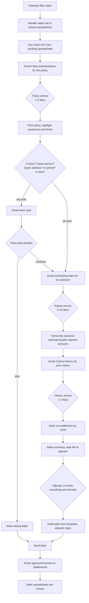
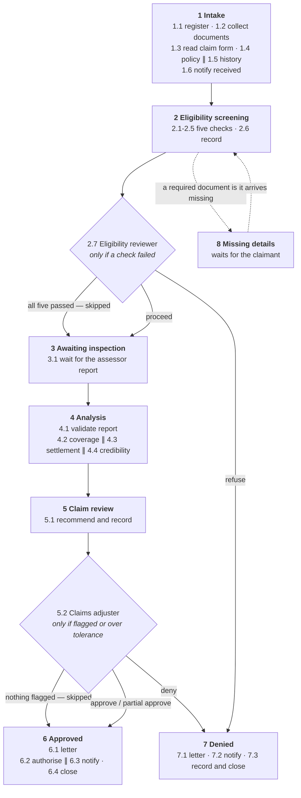

# Process Definition Document — Property Claims Handling

**Client / business unit:** Household Claims, Property & Casualty
**Document owner:** Business Analyst, Claims Transformation
**Status:** Signed
**Version:** 1.0
**Date:** 2026-08-25

> This is a **synthetic process**, written for a build exercise. The behaviour described is internally consistent and complete, and every figure in it is a real oracle you can test against. The organisation and the people are not real, so the sign-off table below records roles rather than names.

## Contents

1. [Purpose and Business Case](#1-purpose-and-business-case)
2. [Process Overview](#2-process-overview)
3. [Personas and Responsibilities](#3-personas-and-responsibilities)
4. [As-Is Process](#4-as-is-process)
5. [To-Be Process](#5-to-be-process-business-level)
6. [Data](#6-data)
7. [Business Rules](#7-business-rules)
8. [Exceptions and Error Handling](#8-exceptions-and-error-handling)
9. [Integrations and System Landscape](#9-integrations-and-system-landscape)
10. [Compliance and Control Requirements](#10-compliance-and-control-requirements)
11. [Reporting and Monitoring Requirements](#11-reporting-and-monitoring-requirements)
12. [Process Variants and Regional Forks](#12-process-variants-and-regional-forks)
13. [Test Data and Canonical Examples](#13-test-data-and-canonical-examples)
14. [Out of Scope for Automation](#14-out-of-scope-for-automation)
15. [Change Control](#15-change-control)
· [Appendices](#appendices) · [Pre-sign-off checklist](#pre-sign-off-checklist)

---

## Document History

| Version | Date | Author | What changed |
|---|---|---|---|
| 1.0 | 2026-08-25 | Business Analyst, Claims Transformation | Initial baseline, signed |
| 1.1 | 2026-08-27 | Business Analyst, Claims Transformation | Whole-claim SLA raised to 25 business days (5.5); SC3 unchanged. The automations already running stated up front (1.2, 2.2, 5.3). Re-signed |

## Sign-off

Signing this document confirms that the business behaviour described here is correct and complete. Changes after sign-off go through [§15 Change Control](#15-change-control).

| Role | Name | Date | Signature |
|---|---|---|---|
| Head of Household Claims (process owner) | — | | |
| Claims Operations Manager (business sponsor) | — | | |
| Business Analyst (author) | — | | |
| Solution Architect (reviewer) | — | | |

## Key Contacts

| Role | Scope |
|---|---|
| Head of Household Claims | Owns the process, the decision thresholds, and the claims handling standard |
| Claims Team Lead | Owns day-to-day queue management, SLA escalations and reassignment |
| Business Analyst | Owns this document |
| Solution Architect | Owns the design that implements it |
| System owner — Policy Administration | Access, change windows, policy document format |
| System owner — Claims History | Access, retention of settled-claim records |

## Glossary and Operational Vocabulary

The business uses these words exactly as spelled here. Synonym drift turns into wrong stage, role and outcome names downstream.

| Term | Exact form used by the business | Meaning | Never call it |
|---|---|---|---|
| Claim | claim | One request for payment under one policy for one incident | case, ticket, file |
| Claim submission form | claim form | The document the claimant completes | application, FNOL form |
| Assessor report | assessor report | The independent inspection report on the damage | adjuster report, survey, inspection |
| Cause determination | cause determination | The assessor's professional finding of what caused the loss | root cause, incident type |
| Deductible | deductible | The amount the policyholder bears before the policy pays | excess, franchise |
| Sublimit | sublimit | A cap on one category inside a coverage section | inner limit, category cap |
| Annual aggregate | annual aggregate | The maximum payable for all property losses in one policy period | annual cap, total limit |
| Named peril | named peril | A cause the policy lists as covered; anything unlisted is not covered | listed risk |
| Open peril | open peril | Covered unless an exclusion applies | all-risk |
| Endorsement | endorsement | A clause added to the policy that changes what it does | rider, addendum |
| Loss of use | loss of use | Additional living costs while the property is uninhabitable | ALE, displacement |
| Eligibility screening | eligibility screening | The early check on whether the claim is worth investigating | triage, pre-check |
| Claim review | claim review | The decision on whether the claim is payable and for how much | adjudication, final review |

**Decision outcome labels (verbatim):** Approve · Partial approve · Deny · Escalate
**Role titles (verbatim):** Claimant · Independent assessor · Eligibility reviewer · Claims adjuster · Claims team lead
**System short names (verbatim):** Claims Intake · Document Store · Policy Administration · Claims History · Correspondence · Settlements

## Authoritative References

| # | Source | Type | Claim class | Stability |
|---|---|---|---|---|
| R1 | HO-3 Homeowner's Policy wording — issued per claim, and the only authority on that claim's limits, sublimits, deductible, exclusions, named perils and endorsements | Policy | Example internal policy | Varies per policy; read it, never assume it |
| R2 | Claims Handling Standard — the filing deadline, the refusal control, the override rules on settlement amounts | SOP | Example internal policy | Reviewed annually |
| R3 | Fair claims handling expectations — a claimant must be told the outcome in terms they can act on, and a refusal must carry its reason | Supervisory guidance | Industry practice | Stable |

---

## 1. Purpose and Business Case

### 1.1 Purpose of this document

This document describes how a household property claim is handled from the moment it is filed to the moment the claimant is told the outcome, so that a solution can be designed to run it. It supports the decision on what to automate, where a human must stay in the loop, and what "correct" means for each step.

### 1.2 Business objective and target outcome

**Outcome:** Settle straightforward household property claims without human involvement, and spend the claims team's attention on the claims that genuinely need judgement.

**What already exists, and what is asked for.** The department has already automated the deterministic legwork: registering a claim and gathering its three documents, reading the claim form into structured data, retrieving the policy and the claim history, fetching the assessor's report once it is ready, and sending correspondence ([Appendix D](#d--existing-artefacts-to-reuse)). None of that is to be built again. What is asked for is the rest: **link those pieces into one end-to-end handling of each claim, from filing to decision letter**, add the judgement the process needs — screening, report validation, coverage, settlement, credibility, the recommendation, the letters — and put a human in front of the two decisions that need one.
**Primary KPI moved:** cycle time, with manual effort second.
**Current baseline → target:** 15 business days average from claim receipt to decision letter → 2 business days for a claim with nothing wrong, 8 business days overall.

### 1.3 Success criteria

These become the acceptance criteria the finished solution is measured against.

| # | Criterion | Measure | Target |
|---|---|---|---|
| SC1 | Straight-through processing rate | % of claims that reach a decision letter with no human touch at any point | ≥ 30% |
| SC2 | Cycle time, straight-through claim | Business days from claim receipt to decision letter | ≤ 2 |
| SC3 | Cycle time, all claims | Business days from claim receipt to decision letter | ≤ 8 average |
| SC4 | Detection accuracy | % of claims carrying a known material problem that are stopped at the correct decision point, with the problem named | 100% |
| SC5 | False escalation rate | % of claims with nothing materially wrong that are nevertheless referred to a human | ≤ 10% |
| SC6 | Decision traceability | % of decisions recording who decided, when, what they were shown, and the written reason | 100% |

**SC4 and SC5 pull against each other, and that tension is the point.** Stopping every claim satisfies SC4 and fails SC5 and SC1. A process that never stops a claim does the reverse. The measure of the design is meeting both.

### 1.4 Business case

| Item | Value | Source |
|---|---|---|
| Volume per year | 2,400 claims | Claims Operations, 2025 actuals |
| Peak | 340 claims per month, storm season | Claims Operations |
| Average handling time (manual) | 95 minutes per claim | Time study, 2025 |
| Fully loaded cost per handler hour | 48 currency units | Finance |
| Current annual handling cost | ~182,000 currency units | 2,400 × 95 min × 48/hr |
| Expected annual saving | ~95,000 currency units | 30% straight-through, plus 40% effort reduction on the rest |
| Estimated build effort | 25 person-days | Solution Architecture estimate |

### 1.5 Minimum prerequisites for automation

| # | Prerequisite | Owner | Status |
|---|---|---|---|
| P1 | Read access to the Document Store holding claim forms, policies and assessor reports | System owner — Document Store | Confirmed |
| P2 | Read access to Policy Administration for the policy document by policy number | System owner — Policy Administration | Confirmed |
| P3 | Read access to Claims History for settled claims in the current policy period | System owner — Claims History | Confirmed |
| P4 | A channel to send correspondence to the claimant | System owner — Correspondence | Confirmed |
| P5 | A store for the claim record that outlives any single step and can be read while the claim is in flight | Solution Architecture | Confirmed |
| P6 | Sample claims covering every business rule and exception path in §13 | Business Analyst | Confirmed |

---

## 2. Process Overview

### 2.1 Process profile

| Field | Value |
|---|---|
| Process full name | Property Claims Handling |
| Function / department | Household Claims, Property & Casualty |
| Short description | Validate a household property claim against its policy and an independent assessment, decide whether it is payable and for how much, and tell the claimant |
| Business criticality | High — it is the moment the customer judges the insurer |
| SOx / regulated process | No, but subject to fair claims handling expectations (R3) |
| Trigger | The claimant files a claim. It arrives as a completed claim form lodged through Claims Intake, one claim at a time |
| Frequency and business hours | Continuous; handled during business hours |
| Volume per period | 180–260 per month; peak 340 during storm season |
| Average handling time — today / target | 95 minutes / under 10 minutes of human time on a claim that needs a human, none on one that does not |
| FTE involved | 4.5 |
| Exception rate (estimate) | ~65% of claims carry at least one thing a human would want to look at; roughly a third carry nothing |
| Input data | A claim form, an insurance policy document, an assessor report on the damage, and the claim history for the policy |
| Output data | A decision, a settlement amount where one is payable, a written decision letter to the claimant, and an authorised amount handed to Settlements |
| Data sensitivity | PII — claimant name, address, contact details, identity reference, and loss circumstances |
| Must NOT appear in logs | Claimant contact details, identity reference, and the full claim narrative |
| Delivery model | Automation Cloud |
| Products the client rules out | None |

### 2.2 In scope

| # | Activity | Note |
|---|---|---|
| IS1 | Registering the claim and assembling its documents | Automated today — [D1](#d--existing-artefacts-to-reuse) |
| IS2 | Reading the claim form into structured claim data | Automated today — [D2](#d--existing-artefacts-to-reuse) |
| IS3 | Screening the claim for eligibility before an inspection is paid for | |
| IS4 | Waiting for and validating the assessor report | |
| IS5 | Determining what the policy covers for this loss | |
| IS6 | Computing the settlement | |
| IS7 | Assessing the credibility of the claim as presented | |
| IS8 | Producing a recommended outcome and putting it to a human where one is needed | |
| IS9 | Writing and sending the decision letter | Sending is automated today — [D3](#d--existing-artefacts-to-reuse); writing is not |
| IS10 | Recording the outcome and the authorised amount | |
| IS11 | Making claims in flight visible to the claims team lead | |

### 2.3 Out of scope

Nothing here may appear in the solution's component inventory.

| # | Activity | Reason |
|---|---|---|
| OS1 | Instructing the independent assessor to attend | Handled by a separate scheduling team; this process waits for the report, it does not dispatch |
| OS2 | Paying the settlement | Settlements owns payment. This process authorises an amount and hands it over |
| OS3 | Fraud investigation | A separate specialist function, referred to outside this process |
| OS4 | Complaints and appeals after a decision | Separate process |
| OS5 | Underwriting, renewal and policy amendment | Policy Administration owns the policy |
| OS6 | Recovery from a third party after settlement | Later phase |
| OS7 | Liability and medical payments claims | This process handles property damage only |

### 2.4 Assumptions and constraints

| # | Type | Statement | Impact if wrong |
|---|---|---|---|
| A1 | Business | Every claim is made against a single HO-3 household policy, and that policy document is the only authority on its limits, sublimits, deductible, exclusions, named perils and endorsements | A rule that hardcodes any monetary limit is wrong on the next claim |
| A2 | Business | Amounts are handled in the currency of the claim and are never converted | A converted figure is a wrong figure on a document the claimant holds |
| A3 | Business | An assessor report exists for every claim that passes eligibility screening. It may be late, but it arrives | The waiting stage would need an abandonment path |
| A4 | Business | The claim form is signed by the claimant, but the signature is not evidence this process evaluates — it is not visible once the form is read into data | A check that depends on it reports every claim as unsigned |
| A5 | Organisational | The claims team works one queue; any claims adjuster may pick up any claim review | Routing by adjuster would be required |
| A6 | Timing | The current policy period is the one in force on the date of loss | The annual aggregate would be computed against the wrong period |
| A7 | Technical | Documents arrive as PDFs and are retrieved by claim reference | Retrieval would need a different key |

---

## 3. Personas and Responsibilities

| Persona | What they do | Steps involved | Decision authority / thresholds | Touches per period | Must be able to see |
|---|---|---|---|---|---|
| **Claimant** | Files the claim, supplies the form and supporting documents, receives two communications | 1.1, 1.6, 6.3, 7.2 | None | 1 per claim | Confirmation of receipt; the decision and its reason |
| **Independent assessor** | Inspects the property and issues the assessor report with a cause determination and an independent repair estimate | 3.1 | Determines the cause of loss. That determination governs what the policy is read against | 1 per claim reaching inspection | The property and the claim form |
| **Eligibility reviewer** | Decides whether a claim that failed screening should proceed to inspection, and writes the reason | 2.7 | May allow a claim past any failed screening check, or refuse it outright. No monetary authority — nothing about money has been decided at this point | ~40 per month | Every screening check with its result; the claim form; the policy |
| **Claims adjuster** | Decides the outcome and the amount, and writes the reason | 5.2 | Approves any amount up to the policy limits. May adjust an individual settlement line downward, or upward to no more than the higher of the amount claimed and the assessor's estimate for that line. Every adjustment carries a reason | ~110 per month | Every finding, the recommended outcome and its reasons, the settlement line by line, the claim, the policy and the assessor report |
| **Claims team lead** | Watches the queue, chases claims approaching their deadline, reassigns work | — | Reassigns; does not decide claims | Continuous | Every claim in flight, its stage, how long it has been there, and how close it is to its deadline |

**Only the two reviewer roles decide anything.** Everything the system produces is a finding or a recommendation. No automated step refuses a claim.

---

## 4. As-Is Process

### 4.1 As-is narrative

A claim arrives through Claims Intake and is added to a shared spreadsheet the claims team maintains by hand. A claims handler opens the claim form, keys the claimant details and the damage inventory into a working spreadsheet, then requests the policy document from Policy Administration by email and waits — usually a day, sometimes three. When the policy arrives the handler prints it, highlights the exclusions and the schedule of limits, and checks by eye that the policy was in force, that the claimant is the policyholder, and that the address matches. If any of that fails the handler emails the claims team lead, who decides whether to continue; that decision is recorded in the spreadsheet's notes column and nowhere else.

If the claim continues, the handler emails the scheduling team to instruct an assessor, and the claim sits until the report comes back. When it does, the handler reads it against the claim form, transcribes the assessor's line-by-line estimate into the working spreadsheet beside the claimed amounts, and works out the settlement: assign each damage item to a coverage section, apply the section limits, apply any sublimit, subtract the deductible, and check whether earlier claims in the same policy period have eaten into the annual aggregate — which means a separate request to Claims History, by email, and another wait.

The handler then writes a summary and walks the file to a claims adjuster, who reads the three documents again, checks the arithmetic, and decides. The handler drafts the decision letter from a template, the adjuster signs it, and it is sent. The approved amount is emailed to Settlements. The spreadsheet row is marked closed.

### 4.2 As-is process map

### 4.3 Applications used today

| Application | Interface type | Access method | How a human authenticates | Quirks |
|---|---|---|---|---|
| Claims Intake | Web | Browser | Corporate sign-on | Claims arrive one at a time; no bulk view |
| Document Store | Web + API | Browser, or API by claim reference | Corporate sign-on | Documents are PDFs; no text layer guarantee |
| Policy Administration | Web + API | Request by policy number | Corporate sign-on | Policy documents are issued as PDFs in each insurer's own wording |
| Claims History | Web + API | Request by policy number and period | Corporate sign-on | Returns settled claims only; an empty result is a valid answer |
| Correspondence | Web + API | Template plus merge data | Corporate sign-on | |
| Settlements | Web | Manual entry today | Corporate sign-on | Receives an amount and an approver, nothing else |
| Shared claims spreadsheet | Desktop file | Network share | File share permissions | The only in-flight view that exists. One editor at a time; overwrites are common |
| Handler working spreadsheet | Desktop file | Local disk | — | Per-handler, never shared, deleted when the claim closes |

### 4.4 Pain points and manual workarounds

| # | Pain point / workaround | Step(s) | Exists only because a human does the work? | Impact |
|---|---|---|---|---|
| PP1 | Keying the claim form into a working spreadsheet | 4.1 | **Yes** | 20 minutes per claim, and a transcription error changes a settlement |
| PP2 | Printing and highlighting the policy | 4.1 | **Yes** | 10 minutes, and the highlighted copy is thrown away |
| PP3 | Requesting the policy by email and waiting | 4.1 | **Yes** | 1–3 days of pure wait on a request an API can answer |
| PP4 | Requesting the claim history by email and waiting | 4.1 | **Yes** | 1–2 days, and it lands after the settlement has already been drafted, so it is often skipped |
| PP5 | The shared spreadsheet as the only in-flight view | all | **Yes** | Rows overwritten daily; nobody can say how many claims are near their deadline |
| PP6 | The adjuster re-reads all three documents from scratch | 4.1 | No — the decision is theirs | 25 minutes per claim spent rebuilding what the handler already knew |
| PP7 | The eligibility decision recorded only in a notes column | 4.1 | **Yes** | No audit trail; the reason is lost when the row is overwritten |
| PP8 | Deductible applied per damage line by mistake | 4.1 | No — an arithmetic error | Under-settlement, and the commonest source of complaints |
| PP9 | The annual aggregate checked last, or not at all | 4.1 | No — a sequencing error | Over-settlement that has to be recovered |

**PP1–PP5 and PP7 disappear in the to-be.** They exist only because a person is moving data by hand. PP6, PP8 and PP9 are not automation targets in themselves — they are what the to-be must not reproduce.

### 4.5 Volumetrics by step

| Step | Time per item | Total effort per month (200 claims) |
|---|---|---|
| Register and key the claim form | 20 min | 67 hrs |
| Obtain and read the policy | 15 min active | 50 hrs |
| Screening checks | 10 min | 33 hrs |
| Read and transcribe the assessor report | 15 min | 50 hrs |
| Work out the settlement | 20 min | 67 hrs |
| Adjuster review | 25 min | 83 hrs |
| Letter and close | 10 min | 33 hrs |
| **Total** | **95 min** | **383 hrs** |

---

## 5. To-Be Process (business level)

### 5.1 To-be narrative

The claim is registered as soon as it is filed, its documents are assembled, and the claim form is read into structured data automatically. The policy is fetched by policy number and the claim history for the period is looked up at the same time. The claimant is told the claim has been received.

Five screening checks then run against the claim form and the policy alone — the only two documents that exist at this point. **All five run and all five are reported, passes included.** If every one passes, the claim goes forward for inspection without anybody looking at it. If any fails, an eligibility reviewer sees all five with their results and decides whether the claim proceeds, in writing. That decision comes before an assessor is paid for, which is the whole reason the check sits here.

The claim then waits for the assessor report. When it arrives, it is validated and turned into structured assessment data, and three examinations run at the same time against it: what the policy covers, what the settlement comes to, and whether the claim as presented is credible.

The decision rules are then applied to produce a recommended outcome, its reasons, and a confidence — and that recommendation is recorded before anybody is asked to look at it. If nothing was flagged and the amount is within tolerance, the claim settles on that recommendation with no human involved. Otherwise a claims adjuster sees every finding side by side, the recommendation, and the settlement line by line, and decides the outcome and the amount, in writing.

Either way the claim reaches exactly one of two endings. **Approved:** the approval letter is drafted, then the settlement is authorised and the claimant notified at the same time, and the claim closes. **Denied:** the refusal letter is drafted, the claimant is notified and the refusal recorded, and the claim closes. A claim refused at eligibility screening goes straight to the denied ending, having had no assessment at all.

Throughout, everything each step produced is written to the claim record, and the claims team lead can see every claim in flight, its stage, and how close it is to its deadline.

### 5.2 To-be process map

Step numbers match [§5.3](#53-detailed-step-table) exactly and are stable across versions.

### 5.3 Detailed step table

Actor is a human role, or **system**. What kind of system, and how many pieces it is built from, is a design decision and is not stated here.

**Decision nature is the most load-bearing column in this document.** *Rule-expressible* means the rule can be written down and applied the same way every time. *Judgement* means something is being weighed, and what is being weighed is named.

#### Stage 1 — Intake

| Step | Action | Actor | System / data touched | Decision nature | Expected result | Remarks |
|---|---|---|---|---|---|---|
| 1.1 | collect the claim and open a record for it | system | Claims Intake | n/a | A claim reference exists and a record for this claim exists | The record is created here because every later step writes to it **Automated today — reuse [D1](#d--existing-artefacts-to-reuse)** |
| 1.2 | collect the documents filed with the claim | system | Document Store | n/a | The claim form, and any other document filed with it, are attached to the claim | Runs at the same time as 1.1 **Automated today — reuse [D1](#d--existing-artefacts-to-reuse)** |
| 1.3 | transform the claim form into structured claim data | system | — | n/a | Claimant, property, policy number, incident date and type, the damage inventory with per-item amounts, the total claimed, the submission date and whether temporary repairs were made are all available as data | The form has a fixed layout — see [§5.6](#56-documents-and-unstructured-input) **Automated today — reuse [D2](#d--existing-artefacts-to-reuse)** |
| 1.4 | collect the policy document for the policy number on the form | system | Policy Administration | n/a | The policy document for this claim is attached to the claim | Runs at the same time as 1.5 **Automated today — reuse [D3](#d--existing-artefacts-to-reuse)** |
| 1.5 | collect claims already settled against this policy in the current policy period | system | Claims History | n/a | The settled amounts for the period are available | **No prior claims is a result, not missing data** **Automated today — reuse [D3](#d--existing-artefacts-to-reuse)** |
| 1.6 | notify the claimant that the claim was received | system | Correspondence | n/a | The claimant has been told, and the record says so | Needs the claimant's contact details, which come from 1.3 **Automated today — reuse [D3](#d--existing-artefacts-to-reuse)** |

#### Stage 2 — Eligibility screening

All five checks run and all five are reported, whatever the result. A failure sets the overall result; it does not stop the other checks.

| Step | Action | Actor | System / data touched | Decision nature | Expected result | Remarks |
|---|---|---|---|---|---|---|
| 2.1 | validate that the policy was in force on the date of loss | system | claim data, policy | Rule-expressible — [BR-01](#71-eligibility) | Pass or fail, with the policy's payment status and period quoted | |
| 2.2 | validate that the claimant and the policyholder are the same person | system | claim data, policy | **Judgement** — weighing nicknames, middle names and spelling variation against a genuinely different individual | Pass or fail, naming who the policy is in | Two names being similar is not the test; being the same person is |
| 2.3 | validate that the claim and the policy describe the same property | system | claim data, policy | **Judgement** — weighing formatting and abbreviation differences against a real difference of address | Pass or fail, quoting both addresses | |
| 2.4 | validate that the incident date falls inside the policy period | system | claim data, policy | Rule-expressible — [BR-04](#71-eligibility) | Pass or fail, giving the loss date and the policy period | |
| 2.5 | validate that the claim was filed within the filing deadline | system | claim data | Rule-expressible with a judgement tail — [BR-05](#71-eligibility) | Pass, fail, or *late with justification* | *Late with justification* is a caveat, not a failure |
| 2.6 | create the screening result | system | claim record | n/a | Every check, its result and its reason are on the record **before** any human is asked to look | A reviewer's screen is built from what has been recorded |
| 2.7 | review the screening result and decide whether the claim proceeds | **Eligibility reviewer** | claim record, claim form, policy | **Judgement** — whether a failed check is a reason to stop, given anything the claimant has documented | Proceed or refuse, with a written reason | **Only reached if at least one check failed.** See [§5.7 H1](#57-human-decision-and-approval-points) |
| 2.8 | transfer the claim for inspection | system | — | n/a | The claim is waiting for an assessor report | Instructing the assessor is [OS1](#23-out-of-scope) — this process waits, it does not dispatch |

#### Stage 3 — Awaiting inspection

| Step | Action | Actor | System / data touched | Decision nature | Expected result | Remarks |
|---|---|---|---|---|---|---|
| 3.1 | wait for the assessor report to become available | system | Document Store | n/a | The assessor report is attached to the claim | A report that is not ready yet is the normal state of this stage, not an error **Automated today — reuse [D3](#d--existing-artefacts-to-reuse)** |

#### Stage 4 — Analysis

| Step | Action | Actor | System / data touched | Decision nature | Expected result | Remarks |
|---|---|---|---|---|---|---|
| 4.1 | validate the assessor report and transform it into structured assessment data | system | assessor report, claim data, policy | **Judgement** — weighing what a report must contain against what an external contractor actually wrote | The report is confirmed to belong to this claim, to be complete and self-consistent; the assessment is available as structured data; the conclusion is *proceed*, *escalate* or *unusable* | Everything downstream reads the structured assessment, not the document |
| 4.2 | decide which coverage sections respond to the loss, and mark every damage item covered or excluded | system | policy, assessment, claim data | **Judgement** — reading the policy's exclusions, named perils and conditions against the facts of the loss | Every damage item assigned to a coverage section and marked covered or excluded, each with the policy wording it was decided on | Runs at the same time as 4.3 and 4.4. Rules in [§7.3](#73-coverage) |
| 4.3 | transform the covered items into a settlement | system | policy, assessment, claim data, prior claims | Rule-expressible — [§7.4](#74-settlement) | A settlement, line by line, with section subtotals, every cap that bound it named, and a net amount | Runs after 4.2 — it settles the items coverage found covered — and beside 4.4 |
| 4.4 | decide how credible the claim is as presented | system | claim data, assessment, prior claims | **Judgement** — weighing the claimant's account, the documentation and the timing against the assessor's findings | Four behavioural reads, each low, medium or high risk, with what was observed | Runs at the same time as 4.2 and 4.3. Rules in [§7.5](#75-credibility) |

#### Stage 5 — Claim review

| Step | Action | Actor | System / data touched | Decision nature | Expected result | Remarks |
|---|---|---|---|---|---|---|
| 5.1 | decide a recommended outcome and record it | system | every finding from stage 4 and stage 2 | Rule-expressible — [§7.6](#76-the-decision-rules) | A recommendation of Approve, Partial approve, Deny or Escalate, **every** reason that applies, and a confidence — all on the record | **Recorded before 5.2 opens.** A recommendation written afterwards is one the adjuster cannot see |
| 5.2 | review everything and decide the outcome and the amount | **Claims adjuster** | claim record, claim form, policy, assessor report | **Judgement** — whether the findings and the recommendation justify the amount, and whether circumstances the documents cannot show change it | The outcome, the final settlement amount, and a written reason | **Only reached if something was flagged or the amount is outside tolerance.** See [§5.7 H2](#57-human-decision-and-approval-points) |

#### Stage 6 — Approved

| Step | Action | Actor | System / data touched | Decision nature | Expected result | Remarks |
|---|---|---|---|---|---|---|
| 6.1 | create the approval letter | system | claim record | **Judgement** — explaining the outcome in terms the claimant can act on | A letter stating what was approved, for how much, and why | The letter explains; it never re-analyses. See [§7.7](#77-correspondence) |
| 6.2 | transfer the authorised amount to Settlements | system | claim record, Settlements | n/a | The approved amount and who approved it are recorded and handed over | Paying it is [OS2](#23-out-of-scope). Runs at the same time as 6.3 |
| 6.3 | notify the claimant of the outcome, with the letter | system | Correspondence | n/a | The claimant has the decision and its reason | Runs at the same time as 6.2 **Automated today — reuse [D3](#d--existing-artefacts-to-reuse)** |
| 6.4 | archive the claim | system | claim record | n/a | The claim is closed and its outcome recorded | |

#### Stage 7 — Denied

| Step | Action | Actor | System / data touched | Decision nature | Expected result | Remarks |
|---|---|---|---|---|---|---|
| 7.1 | create the refusal letter | system | claim record | **Judgement** — explaining a refusal in terms the claimant can act on | A letter stating the claim is refused and why | A claim refused at 2.7 has had no assessment, so its letter cites only the screening finding and the reviewer's reason |
| 7.2 | notify the claimant of the outcome, with the letter | system | Correspondence | n/a | The claimant has the decision and its reason | Runs at the same time as 7.3 **Automated today — reuse [D3](#d--existing-artefacts-to-reuse)** |
| 7.3 | archive the claim as refused | system | claim record | n/a | The refusal and its reason are recorded and the claim is closed | |

#### Stage 8 — Missing details

| Step | Action | Actor | System / data touched | Decision nature | Expected result | Remarks |
|---|---|---|---|---|---|---|
| 8.1 | wait for the claimant to supply a required document | system | — | n/a | The document arrives and the claim resumes screening | **This stage must exist in the lifecycle and must do nothing yet.** It is a known future requirement, deliberately unwired — see [§15](#15-change-control) |

### 5.4 Control-flow structure

**This subsection decides the shape of the solution.** Absent structure is written as *No* and must not be inferred.

| Structure | Present? | Where, and what exactly happens |
|---|---|---|
| Parallel work that forks and rejoins | **Yes** | Three places. 1.1 ∥ 1.2, then 1.4 ∥ 1.5 — all branches must finish before screening starts. 4.2 → 4.3, with 4.4 beside them — the settlement is computed over the items coverage found covered, so 4.3 reads 4.2's output; credibility reads neither. All three must finish before the recommendation is made. 6.2 ∥ 6.3, and 7.2 ∥ 7.3 — both must finish before the claim closes |
| Wait on an external event | **Yes** | 3.1 — the assessor report is produced outside this process and arrives when it arrives, typically 5–15 days. 8.1 — a document from the claimant |
| Wait on a clock | No | Nothing is scheduled or batched. The filing deadline is a rule applied to dates, not a wait |
| Per-step deadline or timeout | **Yes** | Every stage has its own deadline, and the claim as a whole has one — see [§5.5](#55-lifecycle-stages-and-slas). At-risk and breach both notify; neither cancels the claim |
| Cancel or compensate earlier work on failure | No | Nothing this process does before the ending is irreversible, so nothing needs undoing. The two irreversible acts are both in the endings — see [§8.4](#84-reversibility-and-risk) |
| Reusable group of steps repeated in several places | **Yes, one** | Drafting a decision letter and notifying the claimant happens identically in both endings, on different content |
| Handoff to a separate long-running process | **Yes** | 6.2 hands an authorised amount to Settlements and does not wait for payment |
| Work arrives in batches or item by item | **Per item** | One claim at a time. One claim failing affects no other |

**State outlives any single step.** A claim is open for days or weeks, is worked on by more than one person, and every step's output has to be readable by later steps and by a human while the claim is still in flight. The shared spreadsheet in [§4.3](#43-applications-used-today) exists only because nothing else does this today.

### 5.5 Lifecycle, stages and SLAs

**Primary is the path a healthy claim takes. Secondary is everything else** — a wait, an exception, and the unhappy ending. A portfolio view that shows every settled claim as an exception is one nobody can read, which is why *Approved* is primary and *Denied* is not.

| # | Stage | Owner | Considered done when | Required for overall completion | Exceptional / interrupting |
|---|---|---|---|---|---|
| 1 | Intake | system | The claim record exists, the claim form has been read, the policy and the claim history are available, and the claimant has been told | Yes | No |
| 2 | Eligibility screening | system, then Eligibility reviewer where a check failed | The five checks are recorded and the claim is either referred for inspection or refused | Yes | No |
| 3 | Awaiting inspection | Independent assessor | The assessor report is available | Yes | No — **every claim that passes screening waits here**, so it is on the healthy path. It is a wait on a third party, not an exception |
| 4 | Analysis | system | The report is validated and coverage, settlement and credibility are all recorded | Yes | No |
| 5 | Claim review | system, then Claims adjuster where something was flagged | The outcome and the amount are decided and recorded | Yes | No |
| 6 | Approved | system | The letter is sent, the amount is authorised, and the claim is closed | Yes | No — this is what a healthy claim does |
| 7 | Denied | system | The letter is sent, the refusal is recorded, and the claim is closed | No | **Secondary — the unhappy ending** |
| 8 | Missing details | Claimant | The required document arrives | No | **Secondary — an exception.** Placeholder, see [8.1](#stage-8--missing-details) |

**Give no stage two ways in that can both be true at once.** Mutually exclusive entries are fine, and one stage needs them: *Denied* is reached from 2.7 and from 5.2, and a claim takes exactly one of the two.

#### SLAs

| Scope | Duration | At-risk threshold | At-risk action | Breach action |
|---|---|---|---|---|
| Whole claim, from receipt to decision letter | 25 business days | 80% | Notify Claims team lead | Notify Claims team lead and Claims Operations Manager |
| Stage 2 — Eligibility screening | 1 business day | 80% | Notify Claims team lead | Notify Claims team lead |
| Stage 3 — Awaiting inspection | 15 business days | 80% | Notify Claims team lead | Notify Claims team lead — the delay is the assessor's, and chasing is theirs to do |
| Stage 4 — Analysis | 1 business day | 80% | Notify Claims team lead | Notify Claims team lead |
| Stage 5 — Claim review | 3 business days | 80% | Notify Claims team lead | Notify Claims team lead and Claims Operations Manager |
| Stage 8 — Missing details | 20 business days | 80% | Notify Claims team lead | Notify Claims team lead |

**The whole-claim SLA is a breach threshold, not the target.** The stages inside it sum to about 21 business days when every wait runs to its own limit, so a shorter figure would breach on every healthy claim and turn the in-flight view into a permanent alarm. The *target* cycle time is SC3's — 8 business days on average — and is measured, not alarmed on.

**A business day is Monday to Friday, excluding public holidays in the country the policy was issued in ([§12 V1](#12-process-variants-and-regional-forks)).** Every duration in this table is business days. **[BR-05](#71-eligibility)'s filing deadline is the exception and is deliberately calendar days** — it is a term of the policy, not a service target.

**Every notification in this table reaches the Claims team lead the same way: on the dashboard, as [RP4](#11-reporting-and-monitoring-requirements).** No message is sent to an individual and no email leaves the process — internal notification means the claim appears in a view someone is already watching. [Correspondence](#9-integrations-and-system-landscape) is for the claimant and is never used for an internal alert.

**A breach never closes or refuses a claim.** It makes someone aware. A claim that has breached carries on exactly as it would have.

#### Exit paths — every one, not just the happy path

| # | Exit | When it happens | Counts as completed? |
|---|---|---|---|
| E1 | Settled | The claim is approved or partially approved, the letter is sent and the amount authorised | Yes |
| E2 | Refused at screening | The eligibility reviewer refuses at 2.7. No assessment ever runs | No |
| E3 | Refused at review | The claims adjuster denies at 5.2. **There is no automatic route to this exit** — a Deny recommendation always opens H2 ([C1](#10-compliance-and-control-requirements)) | No |
| E4 | Settled at zero | Every covered item is absorbed by the deductible. A valid covered claim that happens to pay nothing — **this is E1, not a refusal** | Yes |

### 5.6 Documents and unstructured input

**Only one of the three is a form**, and the distinction is not a technical detail — it is what these documents *are*.

| Document type | How it arrives | Structure | Fields that must be read | Human confirmation needed? | Layout variability | Change frequency | Where stored |
|---|---|---|---|---|---|---|---|
| **Claim submission form** | Filed by the claimant through Claims Intake | **Structured** — the insurer's own form, same layout every time | Claimant name and contact details, property address, policy number, incident date, incident type, description of what happened, itemised damage inventory with per-item amounts, total claimed, submission date, whether temporary repairs were made | No | Low | Rarely — a form redesign is a project | Document Store, by claim reference |
| **Insurance policy** | Retrieved from Policy Administration by policy number | **Free-form** — contract prose. Coverage sections, schedule of limits, sublimits, deductible, exclusions list, named perils, special conditions, endorsements. Written differently by every insurer | Whatever the claim turns on. A policy's meaning is in the wording of its clauses, and a decision has to quote the exact sentence it relied on | No | **High** — no two insurers word a policy the same way | Per policy | Document Store, by claim reference |
| **Assessor report** | Produced by the independent assessor and filed against the claim | **Free-form** — written by an external contractor who may put anything in it, in any order | Assessment date, assessor name and licence, observed damage, cause determination, independent repair estimate, the assessor's authorisation | No | **High** | Per assessor | Document Store, by claim reference |

**A fixed field set does not survive the next insurer's wording**, and flattening a policy into fields loses the sentence the decision rests on. The claim form is the opposite: one layout, one place for every field.

### 5.7 Human decision and approval points

Business intent, not a form specification. Every outcome is named.

| # | Touchpoint | Who decides | What they need to see | What they may change | Outcomes | What each outcome causes | Delegable? | If nobody acts within the SLA |
|---|---|---|---|---|---|---|---|---|
| **H1** | Eligibility review — *is this claim worth investigating?* | Eligibility reviewer | All five screening checks with their results and reasons, passes included; the claim form; the policy. **Not a summary** | Nothing. They decide, they do not edit | **Proceed** · **Refuse** | Proceed → the claim is referred for inspection. Refuse → the claim goes straight to the Denied ending with no assessment and no settlement | Yes, to another Eligibility reviewer | The claim stays open and the Claims team lead is notified. It is never auto-decided |
| **H2** | Claim review — *is this claim payable, and for how much?* | Claims adjuster | Every finding from stage 4 side by side, the recommended outcome with **every** reason and its confidence, the settlement line by line with every cap that bound it, the three documents, and every letter already sent to the claimant. **Not a summary** | Any settlement line, up or down, within [BR-61](#78-adjuster-overrides). Every change carries a reason | **Approve** · **Deny** — an approval below the amount claimed is what the recommendation labels *Partial approve*; it is the same decision at a lower amount, not a third button | Approve → the Approved ending, at the amount as it stands after any changes. Deny → the Denied ending | Yes, to another Claims adjuster | The claim stays open and the Claims team lead is notified. It is never auto-decided |

#### When a human is skipped, and why that is safe

**Approval is the one direction allowed to run unattended, and it runs unattended at both touchpoints.** The point of automating this is to clear the clean claims and spend human attention on the ones that need it.

- **All five screening checks pass ⇒ no eligibility reviewer.** The claim is referred for inspection by itself.
- **Nothing flagged and the amount inside tolerance ([BR-44](#76-the-decision-rules)) ⇒ no claims adjuster.** The claim settles on the recommendation.

A claim with nothing wrong is therefore decided end to end with **no human involvement at any point and no review ever raised**. That is the intended outcome and it is what SC1 measures. Concerns still reach a human — they reach the *right* one. What screening can see stops the claim before an inspection is paid for; what only the analysis can see stops it at claim review with every finding on the screen.

Two rules make skipping safe, and they apply to both touchpoints equally.

**Both touchpoints are pulled from a shared queue, not pushed to an individual.** Any holder of the role may take any claim ([A5](#24-assumptions-and-constraints)), which is what makes them delegable and what stops a claim stalling behind one person's absence. Nothing is assigned to a named person at any point.

| Rule | Why |
|---|---|
| **Fail towards the human.** Skip only on an explicit *nothing to review*. A missing or unreadable result means a human looks at it | An absent answer is not a pass |
| **Record the automatic decision as a decision** — what was decided, and that no human decided it | Otherwise the record shows a blank where the reviewer's answer would be, and nobody can tell a clean claim from a lost one |

#### What a human approval binds

A reviewer at either touchpoint does not merely let the claim past — they **accept its exceptions**. A late notice they approved is a granted exception, not an outstanding breach. So every step after a human decision receives three things: the findings, **the decision**, and **the written reason**.

| Situation | What later steps must do |
|---|---|
| A finding the reviewer saw and approved | Treat it as settled. Record it as context where it bears on the step's own work, and cite the reason. **Never restore it to a failure or a warning** |
| The reviewer's reason contradicts a finding | The reason wins. They had the documents and the discretion |
| A fact the step discovered itself | This, and only this, justifies raising a new concern |
| **No human decided** — the touchpoint was skipped | **Nothing was accepted, because nothing was raised.** Later steps receive an explicit *no human has spoken*, not a blank reason, which they would read as approval of everything |

Get this wrong and the reviewer is asked the same question twice, the record says the claim failed after it was approved, and a human's *yes* becomes a machine's *no*.

---

## 6. Data

### 6.1 Data objects

| Object | What it represents | Business identifier | Lifecycle | Owner | System of record |
|---|---|---|---|---|---|
| **Claim** | One request for payment under one policy for one incident | Claim reference | Filed → screened → assessed → decided → closed | Head of Household Claims | The claim record created at 1.1 |
| **Policy** | The contract that says what is covered and to what limits | Policy number | Issued → in force → lapsed, cancelled or expired | Policy Administration | Policy Administration |
| **Assessment** | The independent assessor's findings on the damage | Claim reference + assessment date | Requested → issued | Independent assessor | The assessor report |
| **Settlement** | What the policy pays for this claim, line by line | Claim reference | Computed → adjusted → authorised | Claims adjuster | The claim record |
| **Decision** | The outcome of a human or automatic decision point | Claim reference + touchpoint | Recorded once, never revised | Eligibility reviewer / Claims adjuster | The claim record |
| **Claim history** | What earlier claims on this policy have already paid in this period | Policy number + policy period | Read only | Claims History | Claims History |

### 6.2 Data fields per object

Business meaning only. No storage technology, no field types, no relationships.

**Object: Claim**

| Field | Meaning | Required | Valid values / range | Source | Reads / writes |
|---|---|---|---|---|---|
| Claim reference | Identifies the claim everywhere it appears | Yes | Assigned at 1.1 | Claims Intake | Write once |
| Claimant name | Who is claiming | Yes | | Claim form | Read |
| Claimant contact details | Where correspondence goes | Yes | Never in logs | Claim form | Read |
| Property address | Where the loss happened | Yes | | Claim form | Read |
| Policy number | Which policy is being claimed against | Yes | | Claim form | Read |
| Incident date | When the loss happened | Yes | On or before the submission date | Claim form | Read |
| Incident type | What the claimant says caused the loss | Yes | Fire · Water Damage · Storm/Hailstorm Damage · Wind Damage · Theft/Burglary | Claim form | Read |
| Description of the loss | The claimant's account, in their words | Yes | | Claim form | Read |
| Damage inventory | Every item claimed for, with a category, location, description and amount | Yes | One or more items | Claim form | Read |
| Total claimed | The sum of the inventory | Yes | Currency of the claim | Claim form | Read |
| Submission date | When the claim was filed | Yes | | Claim form | Read |
| Temporary repairs made | Whether the claimant acted to limit further damage | No | Yes / No | Claim form | Read |
| Currency | The currency the claim is stated in | Yes | Never converted ([A2](#24-assumptions-and-constraints)) | Claim form | Read |
| Current stage | Where the claim has got to | Yes | The eight stages in [§5.5](#55-lifecycle-stages-and-slas) | This process | Write |
| Outcome | How the claim ended | No until closed | Settled · Refused | This process | Write |

**Object: Policy** — read from the policy document, never assumed

| Field | Meaning | Required | Source |
|---|---|---|---|
| Policyholder | Who the policy is in | Yes | Policy |
| Insured property address | The property the policy covers | Yes | Policy |
| Effective date / expiration date | The policy period | Yes | Policy |
| Payment status | Whether the policy was in force | Yes | Policy |
| Coverage sections and their limits | Dwelling · Other structures · Personal property · Loss of use | Yes | Policy |
| Sublimits | Caps on categories inside a section — jewellery and precious items, electronics, and anything else the policy schedules | Where they exist | Policy |
| Deductible | What the policyholder bears | Yes | Policy |
| Annual aggregate | The maximum payable for all property losses in one policy period | Yes | Policy |
| Exclusions | What the policy does not cover, as written sentences | Yes | Policy |
| Named perils | The causes personal property is covered against | Yes | Policy |
| Endorsements | Clauses that change what the policy does, including replacement cost | Where they exist | Policy |
| Special conditions | Vacancy, other insurance, duty to mitigate | Where they exist | Policy |

**Object: Assessment**

| Field | Meaning | Required | Source |
|---|---|---|---|
| Assessment date | When the assessor attended | Yes | Assessor report |
| Assessor name and licence | Who assessed, and their authority to | Yes | Assessor report |
| Observed damage | What the assessor found, item by item | Yes | Assessor report |
| Cause determination | The assessor's professional finding of what caused the loss | Yes | Assessor report |
| Independent repair estimate | What the assessor thinks it costs to put right, item by item and in total | Yes | Assessor report |
| Authorisation | The assessor's certification that they issued the report | Yes | Assessor report |

**Object: Settlement** — one row per claimed item, grouped by coverage section

| Field | Meaning | Required |
|---|---|---|
| Item, category and coverage section | Which item, and what the policy reads it under | Yes |
| Amount claimed | What the claimant asked for, for this item | Yes |
| Assessor estimate | What the assessor priced it at | Yes |
| Covered or excluded | Whether the policy responds to this item | Yes |
| Cap applied, and which one | Section limit, sublimit or annual aggregate — named | Where one bound |
| Amount payable | For this item, after any cap | Yes |
| Section subtotals, deductible, net payable | The arithmetic that produces the amount | Yes |

**Object: Decision** — recorded once per touchpoint, whether a human decided or not

| Field | Meaning | Required |
|---|---|---|
| Touchpoint | Eligibility review or Claim review | Yes |
| Outcome | The named outcome from [§5.7](#57-human-decision-and-approval-points) | Yes |
| Decided by | The reviewer, or **explicitly** that no human decided | Yes |
| Decided at | When | Yes |
| Reason | The written reason. Where no human decided, the reasons the rules produced | Yes |

### 6.3 Value mappings

**Incident type on the claim form → coverage peril**

| Claim form value | Peril the policy is read against |
|---|---|
| Fire | Fire |
| Water Damage | Water damage — sudden and accidental discharge |
| Storm/Hailstorm Damage | Windstorm or hail |
| Wind Damage | Windstorm or hail |
| Theft/Burglary | Theft |

**This mapping is the claimant's starting point, not the answer.** Where the assessor's cause determination differs from the incident type on the form, the assessor's determination governs and the conflict is recorded — [BR-15](#73-coverage).

**Policy payment status → in force**

| Policy value | In force on the date of loss |
|---|---|
| Current · Paid · Paid in full | Yes, subject to the policy period |
| Lapsed · Cancelled · Expired · Unpaid from a date before the loss | No |

**Decision outcome → claim outcome**

| Decision | Ending | Claim outcome |
|---|---|---|
| Approve | Approved | Settled |
| Partial approve | Approved | Settled |
| Deny | Denied | Refused |
| Escalate | *not an outcome* — it routes the claim to a human, who then decides one of the three above | — |

*Partial approve* is a recommendation label ([§7.6](#76-the-decision-rules)), not a separate decision: at H2 the adjuster approves at an amount or denies, and the label travels with the record.

### 6.4 Retention, privacy and residency

| Requirement | Detail |
|---|---|
| Retention — claim records | 7 years from closure |
| Retention — claim documents | 7 years from closure |
| Fields to mask in any view outside the claims team | Claimant contact details, identity reference |
| Fields that must never be logged | Claimant contact details, identity reference, the full claim narrative |
| Data residency | The claim is handled in the country the policy was issued in. **Residency here means access control, not hosting** — all six countries in [§12 V1](#12-process-variants-and-regional-forks) are served from one region under one corporate licence, and a claim is visible only to the claims team of its own country |
| Who owns the retention lifecycle | Claims Operations Manager. **Nothing in this process deletes anything** — the periods above are enforced by an archival process outside it |

---

## 7. Business Rules

**One concern, one owner.** Every rule below belongs to exactly one step. A step may cite a fact another step established as supporting evidence, but never as a finding of its own and never as the reason for its own result. A reviewer sees every finding at once, so one problem reported by three steps reads as three unrelated problems.

**Monetary limits, deductibles, sublimits, exclusions and the named-peril list appear nowhere in this document.** They are in each claim's policy document, which is where they must be read from. A rule that hardcodes a limit is wrong on the next claim.

### 7.1 Eligibility

Applied at steps 2.1–2.5. All five run and all five are reported, passes included. A failure sets the overall result; it does not stop the others.

| ID | Rule | Step | Inputs | Outcome | Source | Example |
|---|---|---|---|---|---|---|
| BR-01 | When screening a claim, if the policy's payment status is lapsed, cancelled, expired, or unpaid from a date before the loss, then policy status **fails** | 2.1 | Policy payment status, incident date | Pass / Fail | R1 | Premium unpaid from 12/01, loss on 03/02 → **Fail**: the policy was not in force on the day of loss |
| BR-02 | When screening a claim, if the claimant and the policyholder are not the same individual, then identity **fails**, naming who the policy is in. Nicknames, middle names and minor spelling differences are the same individual; a different given name is not | 2.2 | Claimant name, policyholder | Pass / Fail | R2 | `Sarah Chen Wei Ling` vs `S. Chen Wei-Ling` → **Pass**. `Sarah Chen Wei Ling` vs `Daniel Chen Wei Jie`, same surname and address → **Fail** |
| BR-03 | When screening a claim, if the claim and the policy do not describe one physical address after normalising formatting, then address **fails**, quoting both. `St.`/`Street` and `Apt`/`#` are formatting; a different number is a different address | 2.3 | Property address on both | Pass / Fail | R2 | `#12-456` vs `#12-465`, street, city and postcode identical → **Fail** |
| BR-04 | When screening a claim, if the incident date is outside the policy's effective and expiration dates inclusive, then coverage period **fails**, giving both | 2.4 | Incident date, policy period | Pass / Fail | R1 | Policy expired 28/02, loss 05/03 → **Fail** |
| BR-05 | When screening a claim, if more than **60 calendar days** separate the incident date from the submission date, then the filing deadline **fails** where the form offers no explanation, and is *late with justification* — a caveat, not a failure — where it does | 2.5 | Incident date, submission date, description of the loss | Pass / Fail / Late with justification | R2 | Loss 01/03, filed 20/05, no explanation → **Fail**. Same dates, form explains the claimant was hospitalised → **Late with justification** |

**Two of these are designed to slip past a careless reading.** BR-02 permits nickname variation, so a check that matches on how *similar* two strings look waves a household member's claim through on a spouse's policy. BR-03 normalises `St.`/`Street`, which will never close a one-digit gap, because everything except the number still matches.

### 7.2 Assessor report validation

Applied at step 4.1, before anything reads the assessment.

| ID | Rule | Step | Outcome | Example |
|---|---|---|---|---|
| BR-06 | When an assessor report arrives, if it is not for this claim — a different property, a different incident date, a different claim reference — then it is **unusable** | 4.1 | Proceed / Escalate / Unusable | Report names a property two streets away → **Unusable** |
| BR-07 | When validating an assessor report, if any of assessor name, licence, assessment date, property, incident date, cause determination, damage observations, repair estimate or authorisation is absent, then say which and conclude **escalate** | 4.1 | | Estimate present, licence number absent → **Escalate**, naming the licence |
| BR-08 | When validating an assessor report, if it contradicts itself, then conclude **escalate**, quoting both statements | 4.1 | | Narrative says the roof was replaced, the estimate prices a repair → **Escalate** |
| BR-09 | When validating an assessor report, the test is whether every **claimed** item is priced and usable. Damage the assessor observed that nobody claimed for is not missing data | 4.1 | | Assessor notes a cracked window nobody claimed for → **not a finding** |

### 7.3 Coverage

Applied at step 4.2.

| ID | Rule | Step | Outcome | Example |
|---|---|---|---|---|
| BR-10 | Dwelling and other structures are **open peril**: covered unless an exclusion applies. Every exclusion in the policy relevant to this loss must be walked and answered individually | 4.2 | Covered / Excluded per item | *"No exclusions apply"* with nothing walked is not an answer |
| BR-11 | Personal property is **named peril**: the loss must match one of the perils the policy names, or the item is not covered | 4.2 | | Policy names theft, fire, water damage. Loss is earthquake → personal property **not covered** |
| BR-12 | Loss of use follows the underlying peril — covered if that peril is, excluded if it is not | 4.2 | | |
| BR-13 | When the policy states a vacancy condition, if the property stood vacant more than **60 consecutive days** before the loss, then the policy's additional vacancy exclusions engage and the settlement carries a **15% reduction**. **The vacancy fact is not a field on any form** — it appears only where the claimant's description or the assessor's observations happen to record it, so [BR-78](#79-what-is-not-a-finding) governs when neither does | 4.2 | | Vacant 90 days, recorded in the assessor's observations, policy carries the clause → exclusions engage, 15% reduction applies |
| BR-14 | Every item in the damage inventory is assigned to a coverage section and marked covered or excluded. No item is left unassigned | 4.2 | | |
| BR-15 | When the claim form's incident type conflicts with the assessor's cause determination, the assessor's determination **governs** the coverage reading, and the conflict is a **failing** peril classification check | 4.2 | Fail + recorded | Form says Water Damage, assessor determines Storm → **Fail**, even though storm is itself covered. The claim was made on one basis and would be paid on another |
| BR-16 | An exclusion's heading is a label; the exclusion is the sentence under it. Whenever an item is excluded, the words relied on are quoted, and if they do not fit the facts the exclusion does not apply | 4.2 | | Heading *Water Damage*, text excludes seepage *"over a period of 14 or more days"*. A pipe that burst and flooded a flat in an afternoon → **covered** |

### 7.4 Settlement

Applied at step 4.3, in this order. **Settlement computes; it does not adjudicate coverage.** It must assign items to sections to do the arithmetic, but it never raises a finding about *whether* the policy responds — that is BR-10 to BR-16's question.

| ID | Rule | Step | Outcome | Example |
|---|---|---|---|---|
| BR-20 | Every row starts at the **amount claimed**. A covered item pays the claimed amount or its cap, whichever is lower; an excluded item pays nothing | 4.3 | | Claimed 4,500, no cap → payable 4,500 |
| BR-21 | **The assessor's estimate is evidence, not a ceiling.** The only thing that reduces a claim without a human deciding is a cap printed in the policy | 4.3 | | Claimed 4,500, assessor 3,900, no cap → payable **4,500**, and the gap is BR-29's business |
| BR-22 | Total the covered items per coverage section, then cap each section at its policy limit | 4.3 | | Dwelling items 14,500, limit 500,000 → 14,500 |
| BR-23 | Cap the sublimited personal-property categories, then re-total that section | 4.3 | | Jewellery claimed 8,000, sublimit 2,500 → 2,500 |
| BR-24 | **Cap at whatever the annual aggregate has left.** Subtract what earlier settled claims in this policy period have paid from the policy's annual aggregate; where the covered total exceeds the remainder, reduce the rows and name the limit that bound them. **No prior claims is a result, not missing data** | 4.3 | | Aggregate 125,000, earlier claim paid 110,000, covered total 22,000 → payable capped at **15,000**, naming the earlier claim |
| BR-25 | **Subtract the deductible once**, from dwelling + other structures + personal property combined. It does **not** apply to loss of use | 4.3 | | Three sections totalling 16,600, deductible 2,500 → 14,100. Never 2,500 per item and never 2,500 per section |
| BR-26 | If the combined total is below the deductible, those coverages pay nothing. This is a **valid covered claim that pays zero, not a refusal** | 4.3 | Settled at zero | Covered total 1,800, deductible 2,500 → payable 0, outcome **Settled** ([E4](#exit-paths--every-one-not-just-the-happy-path)) |
| BR-27 | Settlement basis is replacement cost where the policy's replacement-cost endorsement is active, otherwise actual cash value. **Active means active** — worded *Yes*, *Active* or *Included* all count. Absent depreciation data is not a reason to fall back | 4.3 | | Endorsement reads *Included*, no depreciation table → **replacement cost**, and any depreciation adjustment is flagged as outstanding |
| BR-28 | Net payable = the capped sections, less the deductible, plus loss of use after its own limit. **Never convert a currency** — report in the currency of the claim | 4.3 | | |
| BR-29 | **Reasonableness** — compare the claimed **total** against the assessor's independent **total**. More than **20%** above it is flagged. Compare totals, never single items: two independent estimates of the same damage always differ line by line, and treating that as a finding buries the claims that deserve one | 4.3 | Flagged / not flagged | Claimed 16,600 against assessed 15,200 → 9%, **not flagged**. Claimed 16,600 against assessed 12,000 → 38%, **flagged**, quoting both totals |

### 7.5 Credibility

Applied at step 4.4. Four behavioural reads, each **low, medium or high risk**. Credibility reads behaviour, not contract terms.

| ID | Rule | Step | Outcome | Example |
|---|---|---|---|---|
| BR-30 | **Narrative consistency** — does the claimant's account match the assessor's findings? A contradiction is material **only when the claimant's own account would make the claimed cause impossible**. Differences in wording, in remembered times, in who was present, are how people recall things | 4.4 | Low / Medium / High | Claimant says the flat was empty and locked all month; the claim is for a burst pipe they noticed and stopped that evening → **High**, quoting both |
| BR-31 | **Estimate behaviour** — the claimed-to-assessed **ratio**, never an amount. At or below **1.20** two professionals are agreeing. Above it, the pattern is noted alongside the other three reads. **Credibility never flags the gap itself** — BR-29 owns that finding and credibility may only cite it | 4.4 | | Claimed 16,600, assessed 15,200, ratio 1.09 → **Low** |
| BR-32 | **Documentation completeness** — is the assessor's licence given, are items described rather than just priced? Missing paperwork is not fraud; it may mean the claim is not ready to decide. **A field that is legitimately empty is not missing** — not every country has a state or province | 4.4 | | Address has no state, country is Singapore → **not a finding** |
| BR-33 | **Timing and pattern** — a submission gap beyond 30 days is notable and beyond 45 is a flag; an assessment on the day of the incident, or more than 60 days after it, is notable; prior claims are read for frequency and similarity. **Same-day assessment means the assessor attended on the day of the loss**; matching the *submission* date is unremarkable | 4.4 | | Loss 01/03, assessed 01/03 → **notable**. Filed 05/03, assessed 05/03 → **not a finding** |

### 7.6 The decision rules

Applied at step 5.1, in this order. **These produce a recommendation, not an outcome. Nothing here closes a claim.**

| ID | Rule | Step | Outcome |
|---|---|---|---|
| BR-40 | **Recommend Deny** if eligibility failed on the policy, the identity, the address, or the coverage period without justification; or nothing is covered and nothing is flagged for escalation; or the payable is zero **because every item is excluded**. A payable absorbed by the deductible is BR-26, not a denial | 5.1 | Deny |
| BR-41 | **Recommend Escalate** if the filing was late but justified; coverage is ambiguous or disputed; the claim exceeds the independent estimate by more than 20%; credibility risk is medium or high; the net payable exceeds 20% of the dwelling limit; or the annual aggregate bound the settlement | 5.1 | Escalate |
| BR-42 | **Recommend Partial approve** where some items are covered and some excluded | 5.1 | Partial approve |
| BR-43 | **Recommend Approve** otherwise | 5.1 | Approve |
| BR-44 | **A claim settles without a human when, and only when, nothing is flagged, credibility risk is low, and the net payable is within 20% of the dwelling limit.** Anything unreadable or absent counts as flagged. Credibility risk is the one soft read that routes on its own: BR-30–33 together produce one level, and medium or high sends the claim to the adjuster whatever the recommendation says — the case checks the level, not the prose. **This rule can only skip an approval.** A Deny recommendation always opens H2, whatever else is true — [C1](#10-compliance-and-control-requirements) has no exception | 5.1 | Skip H2 |
| BR-45 | **Confidence** — no flags is high, one is medium, two or more is low | 5.1 | High / Medium / Low |

**List every reason that applies, not the first one found.** Recommending approval for a claim that also meets an escalation condition is a contradiction, not a judgement call. Priority whenever two apply: **Deny, then Escalate, then Partial approve, then Approve.**

**An escalation condition is met by its own subject, not by any concern anywhere.** A caution raised while computing the settlement is not *"coverage is ambiguous"*. Reading it as one is what turns every claim into an escalation and makes SC1 unreachable.

### 7.7 Correspondence

| ID | Rule | Step | Outcome |
|---|---|---|---|
| BR-50 | The claimant is written to exactly **twice**: the claim was received, and the outcome. There is no third letter, and **never one saying the claim is still under review** | 1.6, 6.3, 7.2 | |
| BR-51 | The outcome message carries the decision letter itself, so the letter is written inside the ending, before the message is sent. Each ending drafts its own — a claim refused at 2.7 never passes through claim review and would otherwise be notified with nothing to send | 6.1, 7.1 | |
| BR-52 | **The letter explains; it never analyses.** By the time it is drafted the claim has an outcome, and every concern raised was ruled on before it. Explain the outcome using them; never re-open their questions, and never ask an approved claimant for a document the decision did not depend on | 6.1, 7.1 | |

### 7.8 Adjuster overrides

| ID | Rule | Step | Outcome |
|---|---|---|---|
| BR-60 | The recommended settlement is **never mutated**. An adjuster's change produces a final figure plus one recorded override per changed line — the original, the new value and the reason | 5.2 | |
| BR-61 | An override is **rejected** above the higher of the amount claimed and the assessor's estimate for that line, or above the line's cap. Downward has no floor | 5.2 | |
| BR-62 | Every override carries a reason. An override without one is not accepted | 5.2 | |

### 7.9 What is not a finding

Every rule above says what to look for. This one says what to leave alone, and it decides whether anything can settle automatically at all.

**The test, every time: could this change what is paid, to whom, or whether the loss is covered?** A difference that cannot is **context**. Put it in the summary if a reader would want it. Do not fail a check for it.

| ID | Rule | Applies to |
|---|---|---|
| BR-70 | *Authorisation* on an assessor report means the assessor certified and issued it. It does not mean the insurer approved anything in advance — **no such approval exists in this process** | 4.1 |
| BR-71 | Two professionals describing the same damage in different words are two professionals, not a discrepancy | 4.1, 4.4 |
| BR-72 | Do not infer wear, defect or neglect from silence. An exclusion has to be affirmatively documented before it bites, and a cause the documents do not discuss is not an excluded one | 4.2 |
| BR-73 | A sudden covered event carries the work needed to reach the damage, including access and the failed component itself | 4.2 |
| BR-74 | **Coverage never re-opens a screening question.** Policy status, identity, address, coverage period and the filing deadline were decided at stage 2 — by a human, or automatically | 4.2 |
| BR-75 | Ordinary section limits and sublimits reduce a settlement **without a human**. That is the contract working as printed, and the claimant holds the document that says so | 4.3 |
| BR-76 | **The annual aggregate is the exception**, and the only one. It is the single cap resting on a claim history the claimant cannot see on any document they hold, so it always reaches a human, and the reason names the earlier claim and what it consumed. A correct settlement the claimant cannot verify becomes a complaint | 4.3, 5.1 |
| BR-78 | **A condition nobody wrote down is not engaged.** Whether a property stood vacant, who occupied it, how long it stood empty — these matter to the policy and reach the process only when someone recorded them. Where the documents are silent, the condition does not apply. Asking a reviewer to confirm four things nobody ever recorded is how they learn to stop reading the caveats | 4.2 |
| BR-77 | **Materiality is not leniency.** BR-15 is the counter-example: a peril conflict is a *failing* check even when the assessor's peril is itself covered. Recording a real problem inside a check that passes is how it reaches approval with a note nobody reads | all |

---

## 8. Exceptions and Error Handling

### 8.1 Business exceptions

| ID | Name | Detected at | How it is detected | What should happen | Who is notified | Can the claim continue? |
|---|---|---|---|---|---|---|
| B-01 | Policy not found for the policy number on the form | 1.4 | Policy Administration returns nothing | Refer to the eligibility reviewer with the policy number quoted | Eligibility reviewer | Yes, to H1 |
| B-02 | A required document was never filed | 1.2 | The claim form, or a document the claim form says accompanies it, is absent | Ask the claimant for it and wait | Claimant | Yes, via stage 8 |
| B-03 | Assessor report unusable | 4.1 | BR-06 | Refer to the claims adjuster; a replacement report is requested outside this process | Claims adjuster, Claims team lead | Yes, to H2 |
| B-04 | Assessor report incomplete or self-contradictory | 4.1 | BR-07, BR-08 | Escalate to the claims adjuster with what is missing named | Claims adjuster | Yes, to H2 |
| B-05 | Claim history unavailable | 1.5 | Claims History does not answer | **Treat as unreadable, not as zero.** The aggregate cannot be applied, so the claim is flagged and reaches H2 | Claims adjuster | Yes, to H2 |
| B-06 | Peril conflict between the form and the cause determination | 4.2 | BR-15 | Fail the peril classification check and flag | Claims adjuster | Yes, to H2 |
| B-07 | Reviewer takes no action within the stage SLA | 2.7, 5.2 | Stage deadline reached | Notify the claims team lead. **Never auto-decide** | Claims team lead | Yes — it waits |
| B-99 | Any other business exception | any | — | Refer to the claims team lead with everything recorded so far | Claims team lead | Decided case by case |

### 8.2 Known technical / system exceptions

What the business wants to happen, not retry counts.

| ID | Name | Detected at | Business expectation | Who is notified |
|---|---|---|---|---|
| E-01 | A source system is unavailable | 1.2, 1.4, 1.5, 3.1 | Retry, then park the claim and make it visible. Never fail the claim | Claims team lead |
| E-02 | A document cannot be read | 1.3, 4.1 | Park and refer to a human. **Never treat an unreadable document as an empty one** | Claims team lead |
| E-03 | Correspondence cannot be sent | 1.6, 6.3, 7.2 | Retry, then park. **The decision stands** — the claim is decided, only the telling failed | Claims team lead |

### 8.3 Unknown exceptions

**Owner of an unclassified failure:** Claims team lead.
**Must be visible within:** 1 business day.
**Is it safe to leave the claim parked?** Yes — nothing before the ending is irreversible ([§5.4](#54-control-flow-structure)), and the claim SLA keeps it visible.

### 8.4 Reversibility and risk

| Step | Irreversible effect | Requires a human gate? |
|---|---|---|
| 6.2 Authorise the settlement | An amount is handed to Settlements for payment | **Conditionally.** A human gate where anything was flagged or the amount is outside tolerance; automatic where BR-44 is satisfied. This is a deliberate control decision, not an omission — see [C1](#10-compliance-and-control-requirements) |
| 6.3 / 7.2 Send the decision letter | The claimant has been told, and cannot be untold | Follows the decision that produced it |
| 7.3 Record the refusal | **A claim is never refused without a named human decision** | **Always** ([C1](#10-compliance-and-control-requirements)) |

---

## 9. Integrations and System Landscape

| System | Role in this process | Direction | API exists? | Reachable from cloud? | Machine-local data? | Owner |
|---|---|---|---|---|---|---|
| Claims Intake | The claim arrives here and starts the process | Inbound | Yes | Yes | None | Claims Operations |
| Document Store | Holds the claim form, the policy and the assessor report | Both | Yes | Yes | None | IT Shared Services |
| Policy Administration | Supplies the policy document by policy number | Inbound | Yes | Yes | None | Underwriting IT |
| Claims History | Supplies claims settled against this policy in the period | Inbound | Yes | Yes | None | Claims Operations |
| Correspondence | Sends the two claimant communications | Outbound | Yes | Yes | None | Customer Communications |
| Settlements | Receives the authorised amount and the approver | Outbound | Yes | Yes | None | Finance Operations — *the manual web entry in [§4.3](#43-applications-used-today) is how it is used today, not a limit of the system* |

**Inbound events**

| Event | Source system | What it means | Correlation key back to the claim |
|---|---|---|---|
| Claim filed | Claims Intake | A new claim exists and this process should start | Claim reference |
| Assessor report available | Document Store | The wait at 3.1 can end | Claim reference |
| Document supplied by claimant | Claims Intake | The wait at 8.1 can end | Claim reference |

---

## 10. Compliance and Control Requirements

| # | Requirement | Source | Steps constrained | Evidence that must be produced | Auditor |
|---|---|---|---|---|---|
| C1 | **No claim is refused without a named human decision-maker and a written reason.** An automated step may recommend denial; only a human may make it | R2, R3 | 2.7, 5.2, 7.3 | The Decision object ([§6.2](#62-data-fields-per-object)) naming who, when and why | Claims Operations Manager |
| C2 | **Approval within tolerance may run unattended.** The control is asymmetric on purpose: a wrong refusal harms the claimant and a wrong approval costs the insurer, and only the first is what the standard protects against | R2 | 5.1, 6.2 | BR-44 satisfied, and the automatic decision recorded as a decision | Claims Operations Manager |
| C3 | **Every decision records what the decider was shown.** A reviewer's screen is built from the record, so anything they were meant to see must be recorded before the touchpoint opens | R3 | 2.6, 5.1 | Findings recorded with a timestamp before the decision's | Claims Operations Manager |
| C4 | **The claimant is told the outcome and the reason** in terms they can act on | R3 | 6.1, 6.3, 7.1, 7.2 | The letter, stored against the claim | Claims Operations Manager |
| C5 | **A settlement reduction the claimant cannot verify from their own documents reaches a human.** In practice this is the annual aggregate and nothing else | R2 | BR-76, 5.1 | The escalation, and a reason naming the earlier claim | Claims Operations Manager |
| C6 | Claimant contact details and identity references are never written to logs or traces | R2, data protection policy | all | Log review | Data Protection Officer |

**Architecture-shaping controls:** a mandatory human decision on every refusal · an audit trail containing who decided, when, what they were shown and why · no monetary limit ever hardcoded outside the policy document · data handled in the country of issue.

---

## 11. Reporting and Monitoring Requirements

| # | Report / view | Frequency | Content | Audience | Where it is viewed |
|---|---|---|---|---|---|
| RP1 | **Claims in flight** | Real-time | Every open claim: reference, claimant, stage, how long it has been in that stage, how close it is to the claim deadline, the amount claimed, and the recommended outcome where one exists | Claims team lead, Claims Operations Manager | A dashboard |
| RP2 | **Awaiting a human** | Real-time | Claims sitting at H1 or H2, and for how long | Claims team lead | A dashboard |
| RP3 | **Closed today** | Daily | Claims settled and refused, with amounts and outcomes | Claims Operations Manager | A dashboard |
| RP4 | **SLA breaches** | Real-time | Claims at risk or breached, at claim and stage level | Claims team lead | A dashboard |
| RP5 | **Straight-through rate** | Monthly | SC1, SC2 and SC5 against target | Head of Household Claims | A dashboard |

**In-flight visibility needed:** a work queue, an SLA and ageing view, and a per-claim drill-down.

**This replaces the shared spreadsheet ([PP5](#44-pain-points-and-manual-workarounds)) and it is a requirement, not a nicety.** It is the only way the claims team lead can do the job §3 gives them, and today no system provides it.

---

## 12. Process Variants and Regional Forks

| # | Variant-defining question | Possible answers | What differs |
|---|---|---|---|
| V1 | Which country was the policy issued in? | Singapore · Germany · Romania · Hong Kong · Australia · India | The currency, the address format, the identity reference label and the date format. **Nothing about the decision rules differs** |
| V2 | Is a replacement-cost endorsement on the policy? | Yes · No | BR-27 — the settlement basis |
| V3 | Does the policy carry a vacancy condition? | Yes · No | BR-13 — additional exclusions and a 15% reduction |

**The base process in [§5](#5-to-be-process-business-level) assumes:** any country in V1, handled in the currency of the claim with no conversion ([A2](#24-assumptions-and-constraints)). The address and identity formats vary by country and a check that assumes one country's shape will fail on the others — **an address with no state is a Singapore address, not an incomplete one** ([BR-32](#75-credibility)).

---

## 13. Test Data and Canonical Examples

### 13.1 Canonical case — complete

A claim with nothing wrong with it. Every figure here is real and the arithmetic is checkable.

| Field | Value |
|---|---|
| Claimant | Sarah Chen Wei Ling |
| Property | Blk 234 Toa Payoh Lorong 1, #12-456, Singapore 310234 — Condominium, built 2005, 1,200 sq ft |
| Country / currency | Singapore / SGD |
| Incident type | Water Damage |
| Cause | A burst water supply pipe in the unit above leaked for several hours, damaging ceiling, walls and flooring in the master bedroom and hallway |
| Policy — dwelling limit | 500,000 |
| Policy — other structures limit | 50,000 |
| Policy — personal property limit | 300,000 |
| Policy — loss of use limit | 125,000 |
| Policy — deductible | 2,500 |
| Policy — jewellery sublimit | 2,500 |
| Policy — electronics sublimit | 5,000 |
| Policy — annual aggregate | 125,000 |
| Prior settled claims this period | None |
| Damage item 1 | Structure – Ceiling, master bedroom, water-damaged panels and plaster, replace — **4,500** |
| Damage item 2 | Structure – Walls, master bedroom and hallway, staining and swelling, two walls, replace — **3,200** |
| Damage item 3 | Structure – Flooring, master bedroom, warped hardwood, 25 sqm, replace — **6,800** |
| Damage item 4 | Personal Property – Electronics, master bedroom, laptop, replace — **2,100** |
| **Total claimed** | **16,600** |

**Expected outputs**

| Point | Expected value |
|---|---|
| BR-01 policy status | Pass |
| BR-02 identity | Pass |
| BR-03 address | Pass |
| BR-04 coverage period | Pass |
| BR-05 filing deadline | Pass |
| H1 eligibility review | **Skipped** — all five passed |
| BR-06 to BR-09 report validation | Proceed |
| BR-10 coverage, items 1–3 | Covered under Dwelling — open peril, no exclusion fits a sudden burst pipe ([BR-16](#73-coverage)) |
| BR-11 coverage, item 4 | Covered under Personal Property — water damage is a named peril on this policy |
| BR-15 peril classification | Pass — the assessor's cause determination agrees with the incident type |
| BR-22 Dwelling subtotal | 14,500, under the 500,000 limit |
| BR-23 Personal Property subtotal | 2,100, under the 5,000 electronics sublimit and the 300,000 section limit |
| BR-24 annual aggregate | Not bound — nothing settled this period |
| BR-25 deductible | 2,500, subtracted **once** from 16,600 |
| BR-28 **net payable** | **SGD 14,100** |
| BR-31 estimate behaviour | Low risk — the ratio is inside 1.20 |
| BR-30, BR-32, BR-33 | Low risk |
| BR-41 escalation conditions | None met |
| BR-43 recommendation | **Approve**, confidence **high** ([BR-45](#76-the-decision-rules)) |
| H2 claim review | **Skipped** — nothing flagged, amount inside tolerance ([BR-44](#76-the-decision-rules)) |
| Exit | **E1 Settled**, SGD 14,100, no human involved at any point, no review ever raised |

**A clean claim raising no review is the pass, not a silence.** The first time one runs it looks as though nothing happened, because the screen you were waiting to answer never appears. Read the record: the checks, the findings and the letter are all on it, and the outcome is Settled.

### 13.2 Examples per rule and exception path

At most one screening-level and one review-level problem is present in any claim. **Each is owned by exactly one rule.** A problem two rules report is a reviewer reading one problem as two.

| Rule / exception | Input | Expected outcome |
|---|---|---|
| BR-01 | Premium unpaid from a date before the loss; the schedule still shows every limit and only the payment status gives it away | Policy status **fails**, saying the policy was not in force on the day of loss. BR-40 recommends Deny |
| BR-02 | The named insured is a different individual from the claimant. Same surname, same address, different given name | Identity **fails**, naming who the policy is in. A reviewer may allow it once a relationship is documented |
| BR-03 | The policy address differs from the claim address by a transposed unit number; street, city and postcode all agree | Address **fails**, quoting both |
| BR-04 | The policy term ended days before the loss and was never renewed; payment status stays truthful | Coverage period **fails**, giving the loss date and the policy period |
| BR-05 | The loss happened more than 60 days before the claim was filed | Filing deadline **fails** where the form offers no explanation; *late with justification* where it does |
| BR-29 / BR-41 | Every figure on the claim sits 25–40% above the assessor's independent estimate | **Flagged**, quoting both totals. Never quietly settled at the lower figure ([BR-21](#74-settlement)) |
| BR-15 | The incident type on the form is not the cause the assessor determined | Peril classification **fails** and the discrepancy is recorded, even where the assessor's peril is covered |
| BR-30 | The claimant's own account asserts something that rules out the cause they are claiming | **High risk**, quoting the two statements side by side |
| BR-24 | An earlier settled claim in the same policy period has consumed most of the annual aggregate | Settlement **reduced and flagged**, naming the earlier claim and what it consumed ([BR-76](#79-what-is-not-a-finding)) |
| B-05 | Claims History does not answer | Treated as unreadable; the claim is flagged and reaches H2. **Not treated as zero** |

**The last two rows in the flagged group are the hard ones, for opposite reasons.** BR-30's contradiction has nothing missing and nothing malformed — every document is internally fine, and it is visible only to something that reads both accounts and understands them. BR-24's aggregate erosion is not in the claim documents at all: the claim is clean, the peril is covered, the assessor agrees, and the settlement still comes out below the amount asked for.

**And roughly a third of claims carry nothing wrong.** Those must pass every check and settle in full with no human touch at any point. A process that finds something to flag on every claim has not learned to be careful — it has learned to always answer *yes* to *"is anything wrong here?"*, which is the easiest way to look thorough and the least useful. That is what SC5 measures.

### 13.3 Test environment and data availability

**Where test data comes from:** claims are generated on demand, complete with their three documents, and can be aimed at any rule or exception path in [§13.2](#132-examples-per-rule-and-exception-path) or produced clean.
**Cleanup expectation after test runs:** test claims and their records are removed with the environment they were created in.

---

## 14. Out of Scope for Automation

| # | Step / activity | Category | Reason |
|---|---|---|---|
| N1 | Instructing the independent assessor to attend | Handled elsewhere | A separate scheduling team owns dispatch. This process waits for the report — [OS1](#23-out-of-scope) |
| N2 | Paying the authorised settlement | Handled elsewhere | Settlements owns payment — [OS2](#23-out-of-scope) |
| N3 | The decision at H1 | Policy requires a human | [C1](#10-compliance-and-control-requirements) — no refusal without a human |
| N4 | The decision at H2 where anything is flagged | Policy requires a human | [C1](#10-compliance-and-control-requirements) |
| N5 | Chasing a late assessor report | Handled elsewhere | The delay is the assessor's; the claims team lead chases on the SLA notification |
| N6 | Deciding whether to refer a claim to fraud investigation | Policy requires a human | [OS3](#23-out-of-scope) |

---

## 15. Change Control

| # | Date | Change | Sections affected | Reason | Raised by | Impact class |
|---|---|---|---|---|---|---|
| 1 | 2026-08-25 | Initial baseline | all | — | Business Analyst | — |
| 2 | 2026-08-27 | Whole-claim SLA 8 → 25 business days; SC3 keeps 8 as the average target | 5.5 | An SLA shorter than the stages it contains alarms on every claim — found by the design stage | Claims department manager | business-process — re-baselined as 1.1 |
| 3 | 2026-08-27 | The automations that already exist are stated up front (1.2), against the activities they cover (2.2) and the steps they perform (5.3) | 1.2, 2.2, 5.3 | Two designs of this document rebuilt what the department already runs; Appendix D alone was read too late | Claims department manager | clarification — same baseline 1.1 |

**Known and deliberately deferred:** the *Missing details* stage ([8.1](#stage-8--missing-details)) is defined and unwired. The business wants the claimant asked for a missing document and the claim to wait, but the request channel is not agreed. The stage exists in the lifecycle so the later change is an addition rather than a restructure. **Do not remove it, and do not build it.**

---

## Appendices

### A — Screenshots

> None. No user interface is being replicated; the applications in [§4.3](#43-applications-used-today) are reached by API.

### B — Sample documents

| # | Document type | Notes |
|---|---|---|
| B1 | Claim submission form | Generated per claim, PDF, fixed layout |
| B2 | Insurance policy | Generated per claim, PDF, free prose |
| B3 | Assessor report | Generated per claim, PDF, free prose |

### C — Sample data files

| # | Content | Notes |
|---|---|---|
| C1 | Claims history for a policy period | Returned by Claims History; an empty result is valid |

### D — Existing artefacts to reuse

| # | Artefact | Type | Why it is relevant |
|---|---|---|---|
| D1 | Claim generation and document retrieval | Automation | Already running; produces the three documents and delivers them to the Document Store |
| D2 | Claim form reading | Document model | Already running; reads the fixed-layout claim form into structured claim data |
| D3 | Policy retrieval, claim history lookup, assessor report retrieval, claimant correspondence | Automations | Already running against the systems in [§9](#9-integrations-and-system-landscape) |

**What already exists is stated as a business fact here, not as a design instruction.** Which of these the solution calls, and how, is a design decision.

---

## Pre-sign-off checklist

- [x] §1.2 states the KPI being moved; §1.3 criteria are numeric
- [x] §2.3 out of scope is explicit, with reasons
- [x] §5.3 every step has an actor; every decision has a stated decision nature
- [x] §5.4 control-flow structure named concretely, or explicitly marked absent
- [x] §5.5 stages, owners, SLAs at both levels, at-risk and breach behaviour, and every exit path
- [x] §5.7 every human touchpoint has all outcomes named and a no-action behaviour
- [x] §7 every rule numbered, testable, and carrying a worked example
- [x] Every threshold numeric, with its comparator, next to the role or action it gates
- [x] §6.3 value mappings complete
- [x] §8.1 exceptions numbered, with detection, action, and a catch-all row
- [x] §8.4 irreversible steps flagged
- [x] §9 per system: API or UI-only, cloud-reachable or on-prem, owner; inbound events have a correlation key
- [x] §5.6 document storage location stated, not assumed
- [x] §2.1 delivery model and product exclusions stated
- [x] §13.1 one complete canonical case with concrete inputs and expected outputs
- [x] §2.1 data sensitivity and no-log fields captured
- [x] §11 reporting requirements captured
- [x] Appendix A — no screenshots apply, stated rather than omitted
- [x] Every material fact traceable to a source in Authoritative References, or marked as an assumption
- [x] **No product or technology selection, prompts, selectors, schemas or connection details anywhere in this document**
